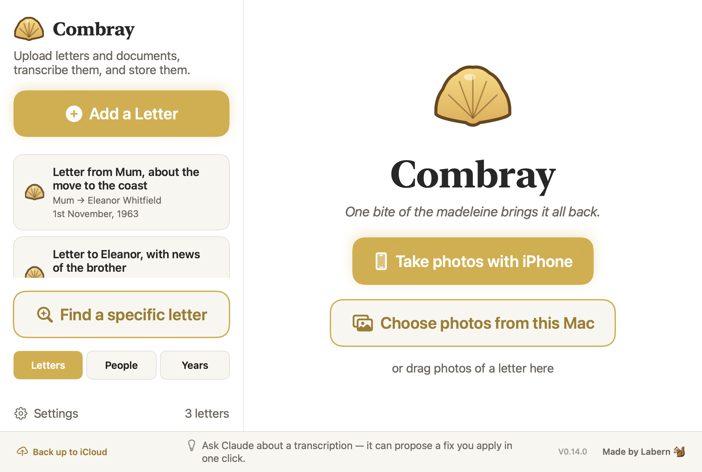
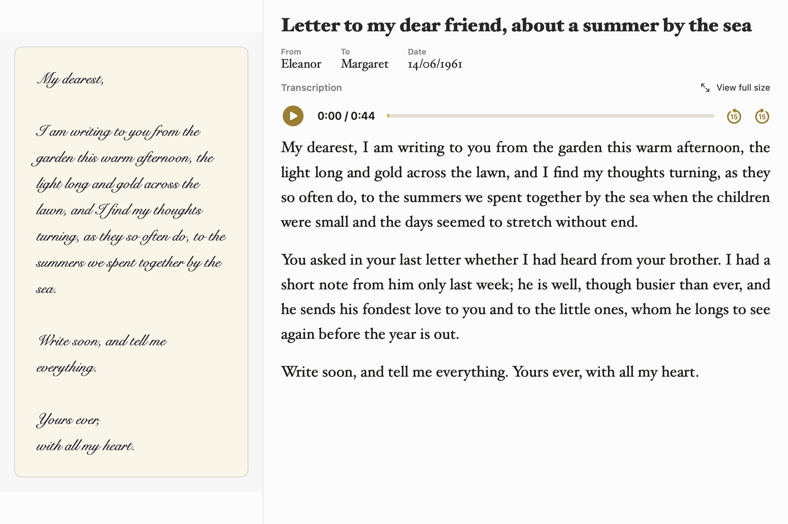
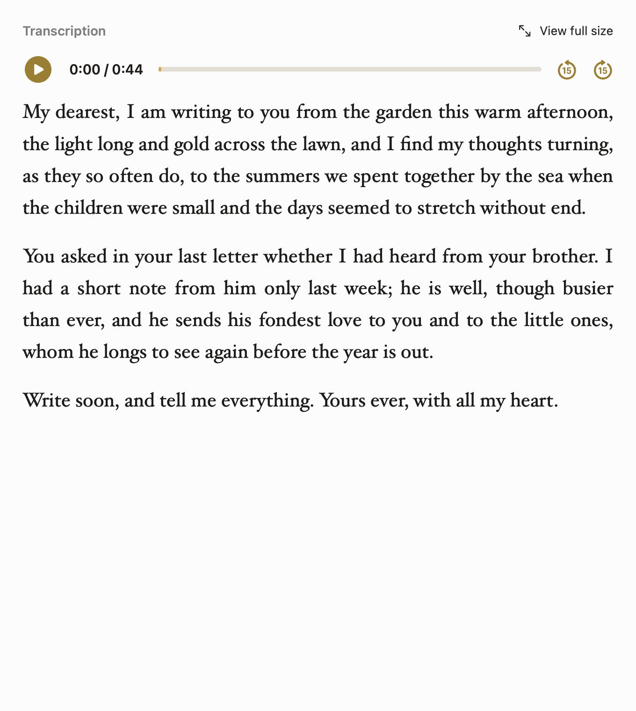
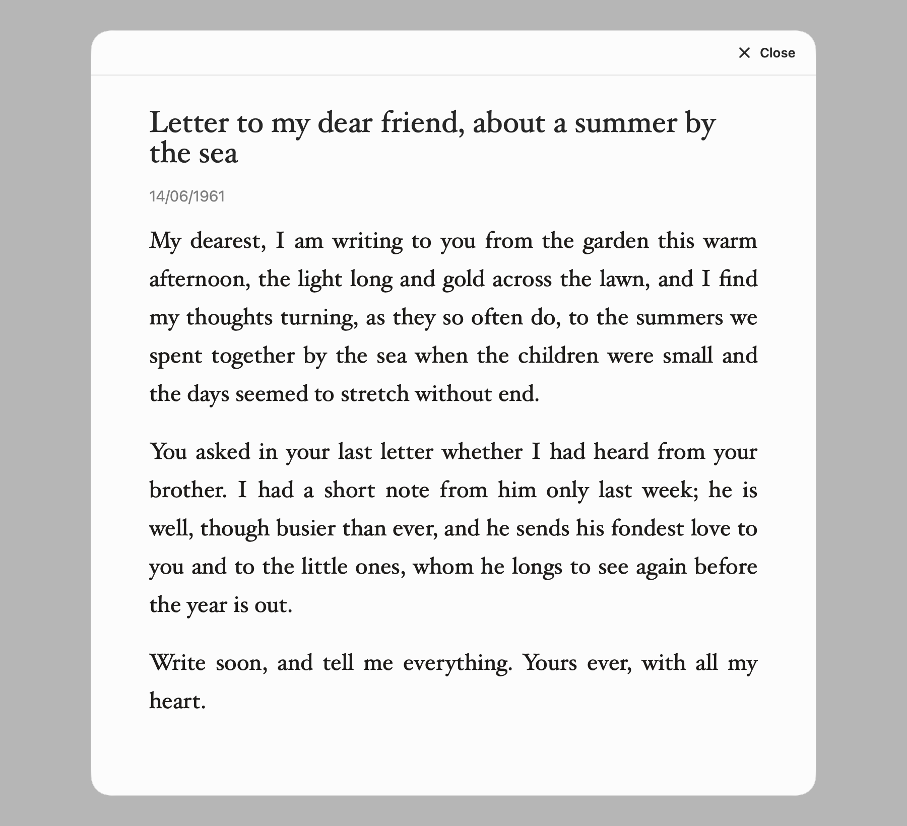

# Combray

*One bite of the madeleine brings it all back.*

**Version: 0.14.0** · **[combray — the website](https://labern.github.io/Combray/)**

A personal **macOS** app that rescues **near-illegible handwritten letters** into a searchable,
browsable archive. Photograph a letter with your iPhone, and **Claude** transcribes it — then stores
it as a structured entry (sender, recipient, date, summary), side-by-side with the photo, organized
by people and year, searchable in full text.



## Download

### Installer (.pkg)

Download the latest **[Combray.pkg](https://github.com/Labern/Combray/releases/latest/download/Combray.pkg)**
and open it. It installs **Combray** into your **Applications** folder (so it shows up in Spotlight,
Launchpad, and the Applications window).

> Combray isn't notarized yet, so the **first** time you open it, right-click **Combray** in
> Applications → **Open** (or run `xattr -dr com.apple.quarantine /Applications/Combray.app`).
> After that it opens normally.

### Homebrew

```sh
brew tap Labern/combray
brew install --cask combray
```

### Automatic updates

From **0.12.0** on, Combray updates itself. It checks GitHub on launch and every 20 minutes; when a
newer release is published, a small **"Restart to update"** bubble appears bottom-left. Click it to
relaunch into the new version, or just **quit and reopen** — the update applies on its own. It only
ever replaces the app bundle, so **your letters are never touched**.

### Build from source

```sh
git clone https://github.com/Labern/Combray
cd Combray
swift run Combray
```

## Features

Combray takes a photograph of a handwritten letter and turns it into a permanent, searchable,
beautifully-set archive entry — the original image on one side, a faithful transcription on the
other. Here is the full tour.

### Capture — get a letter in, however you like

- **Photograph with your iPhone.** The Mac shows a **QR code**; open it on your phone and photograph
  each page. They appear in a strip as you shoot and upload straight into a new letter — your phone
  even shows *Sent → Transcribing → Done*. No companion app to install.
- **Or drag & drop** photos onto the window, or **choose files** from the Mac. Any way of getting the
  pictures across works.
- **Sign in with Claude** — one click, no API key. Combray uses your existing Claude plan: a browser
  page opens, you approve, and you're in.

### Transcribe — Claude reads the handwriting



- **Faithful transcription** of even near-illegible cursive, preserving stars, symbols, and the
  letter's layout.
- **Structured details, extracted automatically** — a "Letter to … from … about …" title, the
  sender and recipients, the date, a short summary, and notable quotes.
- **Endearment → real name.** If your mother signs every letter "sweetness," Combray infers who that
  really is and records the real name in the *To*/*From* field, keeping the original endearment too.
- **Everything is editable.** Fix any word and Combray refreshes the summary and details to match.
  Pinch the photo to zoom; drag the divider to give either side more room; right-click a page to
  replace it with a clearer photo or add another.

### Read — a view made for reading



- **Set like a real letter.** Paragraphs are reflowed and **justified** in a warm serif — no jagged
  early line-breaks. (Screenshots and code keep their exact layout in monospace instead.)
- **Read aloud.** Press play to hear the letter, with the **word being spoken highlighted** as it
  goes, a **position / total timer**, and **±15-second** skip. The voice matches the writer's likely
  sex; if your Mac only has the built-in robotic voices, one click installs a natural one (free).
- **View full size** opens the transcription big and centred for a comfortable read.



### Organise, search & revisit

- **Browse by People** to see everyone someone corresponded with, or **by Years** to read your
  archive as a timeline.
- **Full-text search** across every letter — *"Find a specific letter"* by theme, period, writer, or
  a pair of people, with ranked, highlighted results.
- **Read a correspondence as a chat** *(beta)* — the back-and-forth between two people laid out like
  a modern messaging thread.
- **Pin** up to three important letters to the top of the sidebar.

### Keep & share

- **Export to Word** (`.docx`) in the same beautiful font you read on screen.
- **Share to Gmail** — opens a draft with the letter, one click.
- **Meta — what the letter quietly reveals.** An optional panel surfaces Claude's read on the likely
  location, relationship, its state, the writer's goals, and their likely sex and age.
- **Light & Dark mode**, switchable from the toolbar; the whole look is built on design tokens so it
  re-themes in one place.
- **Automatic updates** (see above) and **one-click iCloud backup** of every letter folder.

## Your data is yours

Every letter is written to a plain, **Finder-browsable folder** at `~/Documents/Combray/letters/<n>/`:

- `letter_<n>_page_<y>.jpg` — the original page images (open them in Preview)
- `letter.json` — sender, date, summary, and the transcription
- `transcription.txt` — the transcription as plain text

The app rebuilds its index from those files on launch, so your archive survives even a future
rewrite of the app. Nothing is locked inside a proprietary database.

---

Built with Swift / SwiftUI + GRDB, transcription by Claude. Named for Proust's village of recovered
memory — and yes, the icon is a madeleine.
